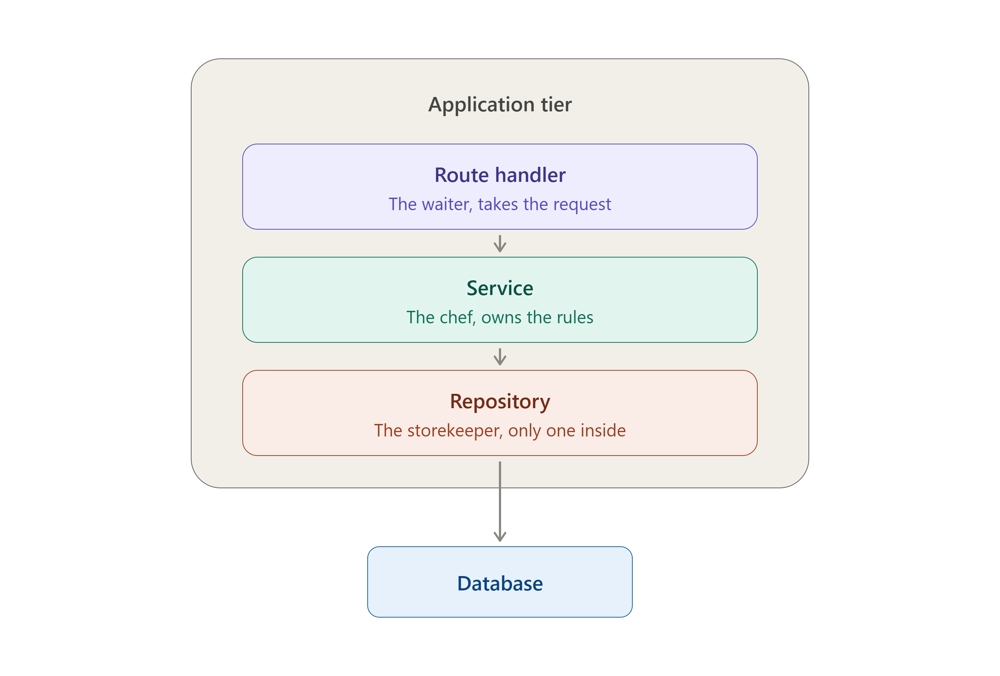

# Loomency

Loomency is a multi-tenant, AI-first customer messaging platform.

Businesses get WhatsApp enquiries at all hours, and someone has to answer them manually. Loomency solves this - a clinic, a dealership, a shop can answer its WhatsApp messages automatically using an AI agent and watch every conversation from one dashboard.

## Tech Stack

- **Next.js:** App Router, API routes 
- **TypeScript**
- **PostgreSQL:** hosted on Neon 
- **Drizzle ORM** 
- **Better Auth:** email/password
- **Zod:** request validation 

## Architecture

N-Layer structure. The Controller-Service-Repository (CSR). The route never calls a repository directly, and `db` appears only in repository files.

- **Route handler/ Controller (Interface/API)** - Handles HTTP requests, session, parsing, status codes.
- **Service (Business Logic)** - The brain of the application. It implements the actual rules, calculations, permissions, and workflows of the system.
- **Repository (Data Access)** - The data manager. It abstracts the data storage (in our case PostgreSQL hosted on Neon with Drizzle ORM) - only this layer touches the database.

The same service functions will also be called from a WhatsApp webhook and from the AI agent, neither of which has an HTTP response to build. Keeping HTTP concerns in the route layer is what makes the services reusable from all three.

## API Endpoints

**Conversations:**

- `GET /api/conversations` — list conversations for your business
- `POST /api/conversations` — start a conversation with a customer
- `GET /api/conversations/:id` — one conversation

**Messages:**

- `GET /api/conversations/:id/messages` — messages in a conversation
- `POST /api/conversations/:id/messages` — send a message

**Customers:**

- `GET /api/customers` — list customers
- `POST /api/customers` — create a customer
- `GET /api/customers/:id` — one customer
- `PATCH /api/customers/:id` — update a customer

**Business:**

- `GET /api/businesses/me` — the logged-in employee's business

**Employees:**

- `POST /api/employees` — invite an employee (admin only)
- `POST /api/invitations/accept` — accept an invitation

## Documentation

- [Security model](docs/security.md) - tenant isolation, RBAC, and the isolation audit
- [Design decisions](docs/decisions.md) - trade-offs and what was deliberately left out 
- [Roadmap](docs/roadmap.md) - planned work 
